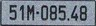

# Image Outpainting: Contextual Image Extension
This project employs **Image Outpainting** techniques, using deep learning models to predict and generate image segments that extend beyond the original canvas while maintaining consistency in content, lighting, and texture.

---
## Project Demo
Below is a sample image used to test the scalability of the model.

<table>
  <tr>
    <th>Input Image</th>
    <th>Output Image</th>
  </tr>
  <tr>
    <td>
      
    </td>
    <td>
      
    </td>
  </tr>
</table>

## Key Features
* **Contextual Continuity:** Ensures objects (such as vehicles, trees, and roads) are scaled up seamlessly.

* **Perspective Consistency:** Maintains the correct viewing angle and aspect ratio of objects in space.

* **Multi-ratio Support:** Supports scaling across various aspect ratios (16:9, 4:3, Square).

# Note
This project was developed as part of research on Computer Vision. In the demo.png image, the focus is on processing the surrounding environment of the car without distorting important details such as the license plate.

© 2025 Phuoc Minh Hieu Pham & Ngoc Tram Anh Vo
